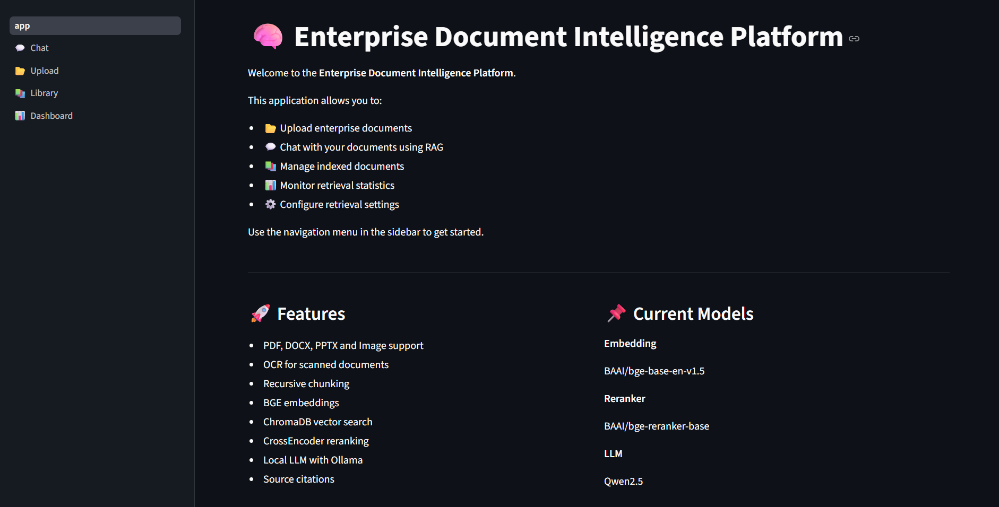
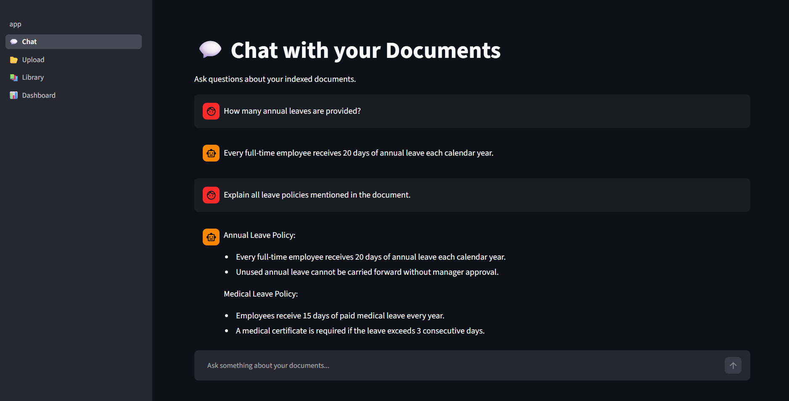
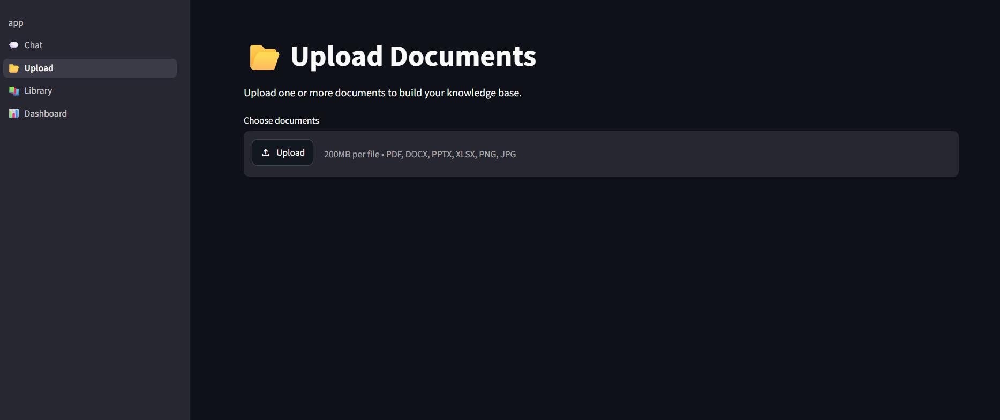
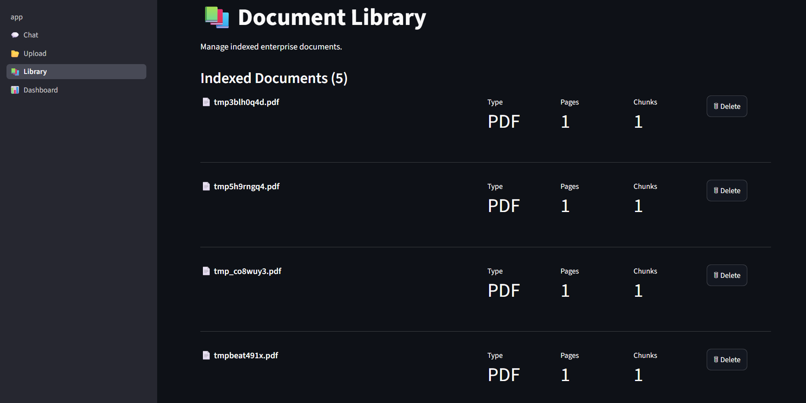
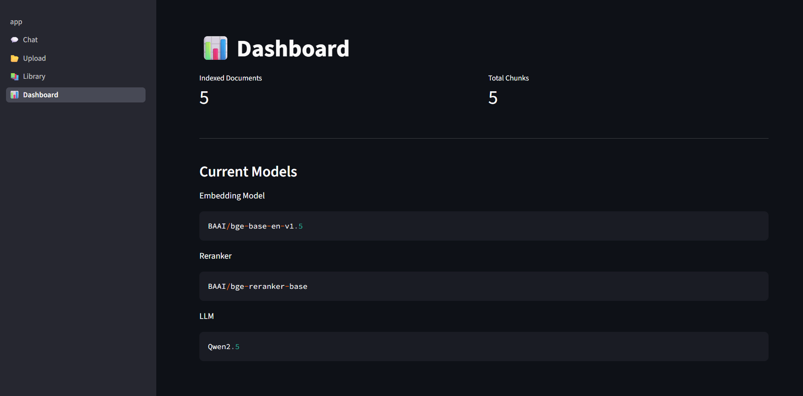
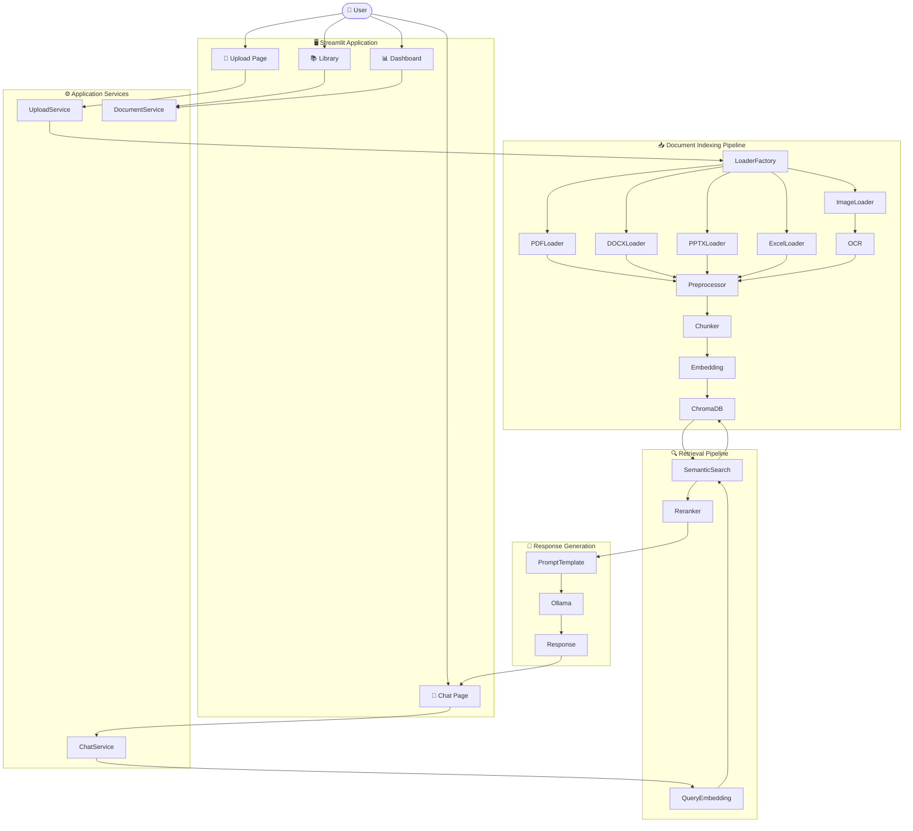

# 🧠 Enterprise Document Intelligence Platform

> A production-inspired Retrieval-Augmented Generation (RAG) system that enables users to upload enterprise documents, build a searchable knowledge base, and interact with them using Large Language Models (LLMs).


---

# 📌 Overview

Enterprise organizations store vast amounts of information in PDFs, Word documents, PowerPoint presentations, spreadsheets, and scanned images. Searching through these documents manually is slow and inefficient.

This project provides an AI-powered Document Intelligence Platform that:

* Uploads enterprise documents
* Extracts text using OCR when necessary
* Splits documents into semantic chunks
* Generates vector embeddings
* Stores embeddings in ChromaDB
* Retrieves the most relevant content using semantic search
* Reranks retrieved chunks with a CrossEncoder
* Uses a local LLM (Ollama) to generate grounded answers
* Displays citations for transparency

---

# ✨ Features

## 📄 Multi-format Document Support

* PDF
* DOCX
* PPTX
* XLSX
* PNG
* JPG
* JPEG

---

## 🔍 OCR Support

Automatically extracts text from scanned image documents.

---

## ✂ Intelligent Chunking

* RecursiveCharacterTextSplitter
* Configurable chunk size
* Chunk overlap
* Metadata preservation

---

## 🧠 Semantic Embeddings

Embedding Model:

**BAAI/bge-base-en-v1.5**

---

## 🗂 Vector Database

* ChromaDB
* Persistent storage
* Duplicate detection
* Document management

---

## 🔎 Retrieval Pipeline

* Semantic similarity search
* CrossEncoder reranking
* Top-K retrieval

---

## 🤖 Local LLM

Powered by:

* Ollama
* Qwen2.5:3B

No external API key required.

---

## 💬 Streamlit Interface

* Chat with documents
* Upload documents
* Document library
* Dashboard

---

# 🏗 System Architecture

```
                    Upload Document
                           │
                           ▼
                    Loader Factory
                           │
        ┌──────────────────┼──────────────────┐
        ▼                  ▼                  ▼
     PDF Loader       DOCX Loader       Image Loader
                                              │
                                              ▼
                                             OCR
                           │
                           ▼
                    Document Preprocessor
                           │
                           ▼
             Recursive Character Chunker
                           │
                           ▼
                 Document Chunks
                           │
                           ▼
                 BGE Embedding Model
                           │
                           ▼
                     ChromaDB
                           │
                           ▼
                Semantic Retriever
                           │
                           ▼
              CrossEncoder Reranker
                           │
                           ▼
                  Prompt Construction
                           │
                           ▼
                    Ollama LLM
                           │
                           ▼
                 Final Answer + Sources
```

---

# 🔄 Application Workflow

## Indexing Pipeline

```
User Uploads Document
        │
        ▼
Loader Factory
        │
        ▼
Document Loader
        │
        ▼
Preprocessor
        │
        ▼
Recursive Chunker
        │
        ▼
Embedding Generator
        │
        ▼
ChromaDB
```

---

## Question Answering Pipeline

```
User Question
      │
      ▼
Query Embedding
      │
      ▼
ChromaDB Search
      │
      ▼
Top-K Chunks
      │
      ▼
CrossEncoder Reranker
      │
      ▼
Prompt Builder
      │
      ▼
Ollama
      │
      ▼
Answer
      │
      ▼
References
```

---

# 📂 Project Structure

```
Enterprise-Document-Intelligence/
│
├── src/
│   ├── chunking/
│   ├── embeddings/
│   ├── ingestion/
│   ├── llm/
│   ├── pipeline/
│   ├── preprocessing/
│   ├── retrieval/
│   ├── services/
│   ├── vectordb/
│   └── utils/
│
├── pages/
│   ├── 1_💬_Chat.py
│   ├── 2_📂_Upload.py
│   ├── 3_📚_Library.py
│   └── 4_📊_Dashboard.py
│
├── streamlit_app/
│   └── services/
│
├── sample_documents/
│
├── vectordb/
│
├── tests/
│
├── requirements.txt
│
├── app.py
│
└── README.md
```

---

# 🛠 Tech Stack

| Category        | Technology             |
| --------------- | ---------------------- |
| Language        | Python                 |
| UI              | Streamlit              |
| OCR             | EasyOCR                |
| Embeddings      | BAAI/bge-base-en-v1.5  |
| Vector Database | ChromaDB               |
| Reranker        | BAAI/bge-reranker-base |
| LLM             | Ollama (Qwen2.5:3B)    |
| Validation      | Pydantic               |

---

# 🚀 Installation

## Clone Repository

```bash
git clone https://github.com/<your-username>/Enterprise-Document-Intelligence.git

cd Enterprise-Document-Intelligence
```

---

## Create Virtual Environment

```bash
python -m venv .venv
```

Windows

```bash
.venv\Scripts\activate
```

Linux / macOS

```bash
source .venv/bin/activate
```

---

## Install Dependencies

```bash
pip install -r requirements.txt
```

---

## Install Ollama

Download and install Ollama from:

https://ollama.com

---

## Pull the Model

```bash
ollama pull qwen2.5:3b
```

---

## Run the Application

```bash
streamlit run app.py
```

---

# 📸 Application Screenshots



## 💬 Chat



---

## 📂 Upload



---

## 📚 Library



---

## 📊 Dashboard



---

# 🏭 Architecture



---

# 📈 Example Queries

### Single Document

* How many annual leaves are provided?
* What is the work from home policy?
* How many medical leaves are available?

### Multiple Documents

* Compare HR Policy and Travel Policy.
* Which document mentions manager approval?
* Summarize all uploaded documents.
* Which policies discuss employee training?
* What security measures are recommended?

---

# 🔬 Future Improvements

* Hybrid Search (BM25 + Dense Retrieval)
* Metadata Filtering
* Conversation Memory
* Multi-user Authentication
* Docker Deployment
* Kubernetes Deployment
* REST API (FastAPI)
* Evaluation Dashboard
* Citation Highlighting in Documents
* Multi-language OCR
* Cloud Vector Databases

---

# 📄 License

This project is licensed under the MIT License.

---

# 👨‍💻 Author

**Priyankush Biswas**

AI / Machine Learning Engineer

GitHub: https://github.com/Priyankush231

LinkedIn: https://leetcode.com/u/Priyankush08/

---

# ⭐ Support

If you found this project useful:

* ⭐ Star the repository
* 🍴 Fork the project
* 📝 Open issues for suggestions
* 🤝 Contribute improvements

Feedback and contributions are always welcome.
